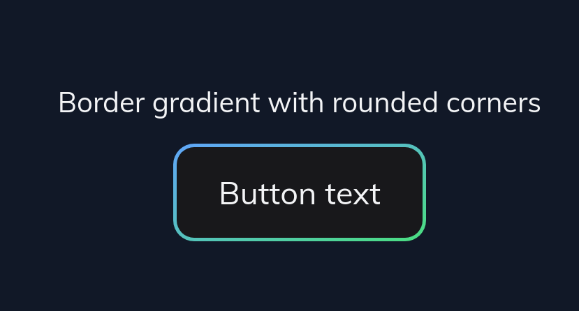

# Border Gradients Plugin for Tailwind CSS based on background-origin and background-image  

Tailwind CSS plugin for generating border gradients with could be used with the rounded utility class.




See it in action: https://play.tailwindcss.com/9LSkQgkY7p
## Requirements

This plugin requires Tailwind CSS 3 or later.

## Installation 
```
npm install tailwindcss-border-gradient-radius
yarn add tailwindcss-border-gradient-radius
```
## Usage

### Simple

```js
{
  theme:     
    extend: {
      linearBorderGradients: ({theme }) => ({
      colors: {
        'light-blue': [colors.indigo[200], colors.lime[300]],
      },
      background: theme('colors'),
      }),
  plugins: [
    require('tailwindcss-border-gradient-radius'),
  ],
}
```

- With colors you can specify your border gradients.
- With background you can specify your background within your button for example.
- (optional) With border you can specify the border of your border gradient

> :warning: **Using variants extend is at the moment not supported!** Please note that at the moment variants could be *only* added by using variants, where you replace all default generated variants. 


### Advanced

```js
{
  theme: {
    linearBorderGradients: {
      directions: { // defaults to these values
        't': 'to top',
        'tr': 'to top right',
        'r': 'to right',
        'br': 'to bottom right',
        'b': 'to bottom',
        'bl': 'to bottom left',
        'l': 'to left',
        'tl': 'to top left',
      },
      colors: { // defaults to {}
        'red': '#f00',
        'red-blue': ['#f00', '#00f'],
        'blue-green': ['#0000ff', '#00FF00'],
        'red-green-blue': ['#f00', '#0f0', '#00f'],
        'black-white-with-stops': ['#000', '#000 45%', '#fff 55%', '#fff'],
      },
      background: {
        'gray-50': '#F9FAFB',
        'gray-900':'#111827',
      },
      borders: { // defaults to these values (optional)
        '1': '1px',
        '2': '2px',
        '4': '4px',
      },
    },

  },
  plugins: [
    require('tailwindcss-border-gradient-radius'),
  ],
}
```

To learn more about the backgrounds of Gradient Borders based on CSS see Method 2: https://dev.to/rumansaleem/gradient-borders-with-css-3mnk


It's recommended to limit the generated utility classes to a miminum to speed up the build process. 


This plugin generates the following utilities:

```css
/* configurable with the "linearBorderGradients" theme object */
.border-gradient-[direction-key]-[color-key]-[background-key] {
    background: 
        linear-gradient( to right, [background-value], [background-value] ), 
        linear-gradient(to [direction-value], [color-value-1], [color-value2], [color-value-n]);
        background-clip: padding-box, border-box;
        background-origin: padding-box, border-box;
}

/* for easier usage it also generates gradient-border for specifying the border width */
.gradient-border-[border-key] {
  border: [border-value] solid transparent;
} 
```

# Example how to use in Tailwind

https://play.tailwindcss.com/9LSkQgkY7p

```html
<div class="bg-gray-900 p-12">
  <div class="text-center">
    <h1 class="text-gray-100 text-medium mb-3">Border gradient rounded and border styled with native tailwind utilities classes </h1>
    <button type="button" class="inline-flex items-center px-6 py-3 border-gradient-br-blue-green-gray-900 border-transparent border-solid border-2 rounded-xl text-gray-100 text-lg">Button text</button>
  </div>
  <div class="text-center m-8 pt-8">
    <h1 class="text-gray-100 text-medium mb-3">Border gradient with rounded-full, hover and gradient-border utility</h1>
    <button type="button" class="inline-flex items-center px-6 py-3 border-gradient-br-blue-green-gray-900 hover:border-gradient-tl-blue-green-gray-900 gradient-border-2 rounded-full text-gray-100 text-lg">Button text</button>
  </div>
</div>


```
